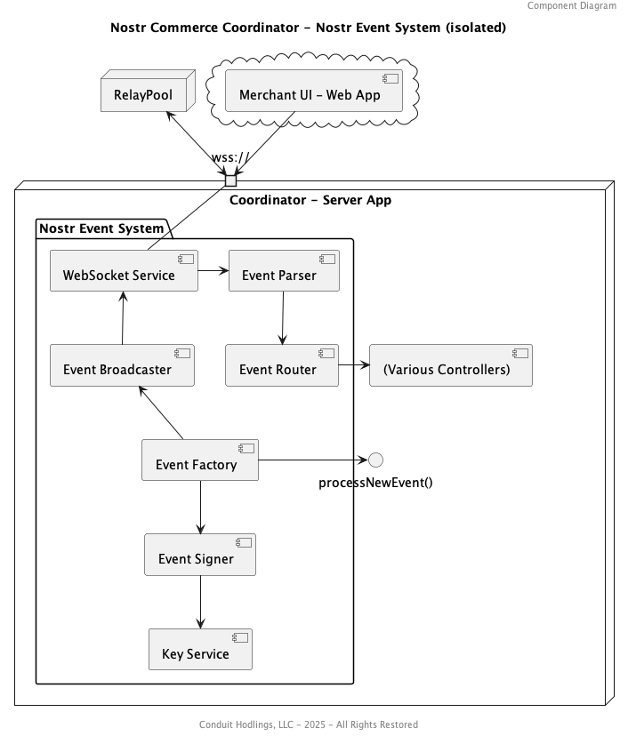
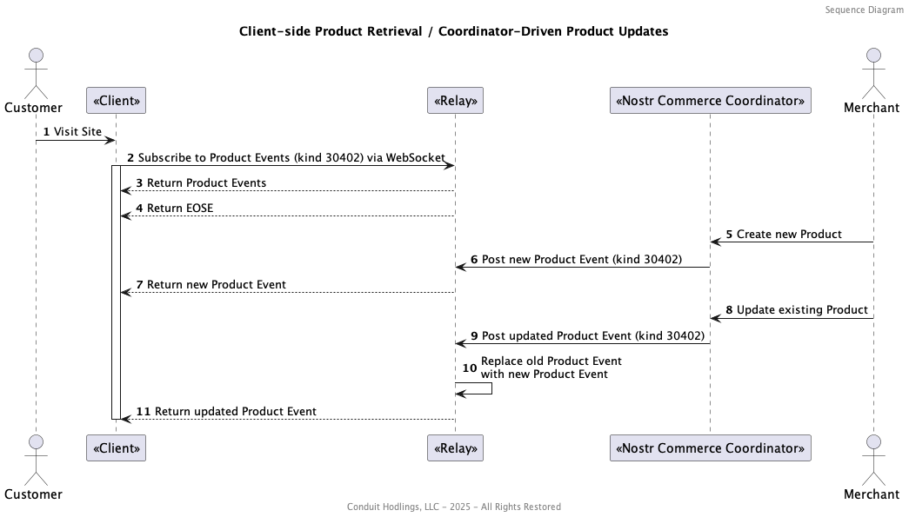

PlantUML Diagrams are being auto-populated from the `out/` directory, into the below README. Will clean up presentation soon.
<!-- AUTO-GENERATED-IMAGES -->
## Diagrams

<!-- END-AUTO-GENERATED-IMAGES -->
